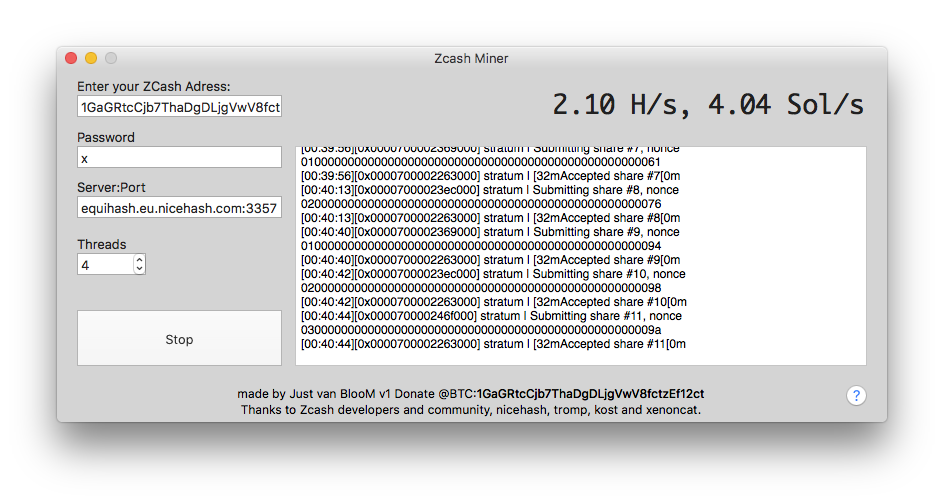

# zcash_mac_nheqminer

go straight to Release section: [click here](https://github.com/justvanbloom/zcash_mac_nheqminer/releases)

Mining Zcash on Mac the easy way.
___

#### Mining on Mac:

___

# Acknowledgments and credits

## Acknowledgements

This miner is based on Equihash Miner for NiceHash

Thanks to Zcash developers for providing most of the code

Special thanks to tromp for providing optimized CPU equihash solver

Special thanks to xenoncat for providing assembly optimized CPU equihash solver

Special thanks to [Zcash Community on Slack](https://zcashcommunity.slack.com)

## Credits

Author of this miner: Kost

Author of Mac GUI for this miner: JustVanBlooM

## Donations

If you feel this project is useful to you. Feel free to donate.

    BTC address: 1GaGRtcCjb7ThaDgDLjgVwV8fctzEf12ct
